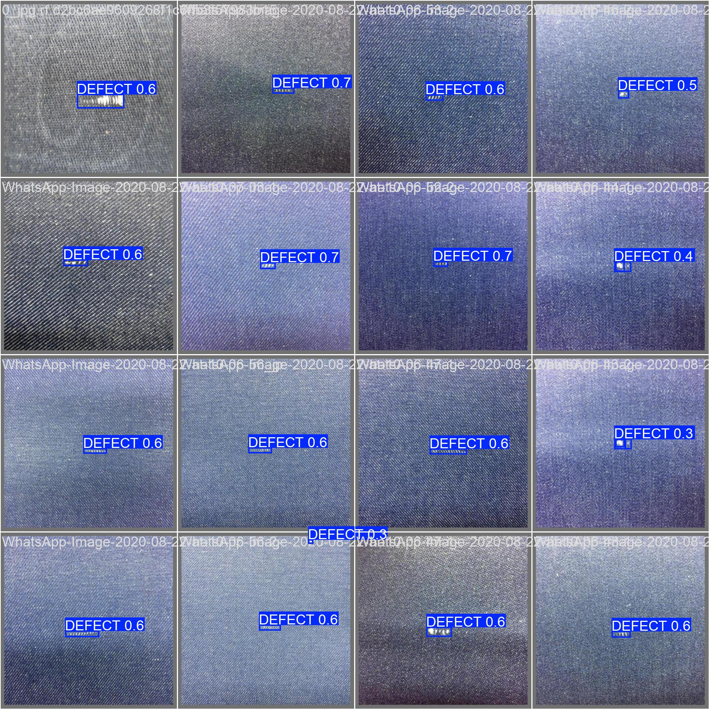
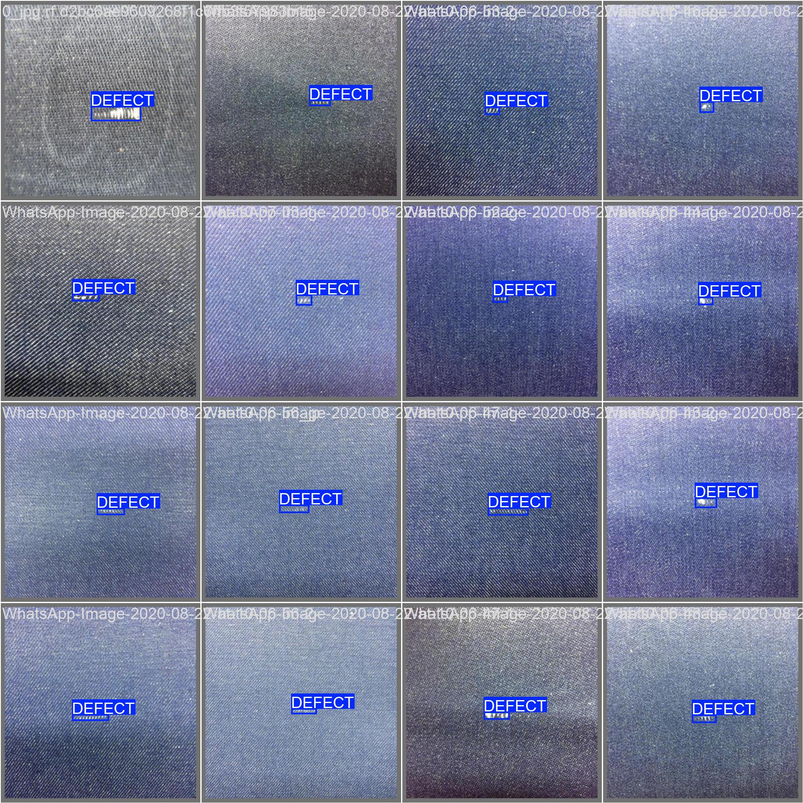

# Anomaly-Detection
Project Overview
This project implements a fabric anomaly detection system using YOLOv5, YOLOv8x, and YOLOv11n models. The system is designed to automatically detect and classify defects in fabric materials, helping to automate quality control in textile manufacturing.

## Dataset

- Source: Roboflow Universe
- Version: 4
- Format: YOLO format
- Classes: ["anomaly"]

## Models Used

- YOLOv5
- YOLOv8x
- YOLOv11n

## Installation

To set up the project environment, follow these steps:

1. Clone the repository:

   ```bash
   git clone https://github.com/javokhirmuso/Anomaly-Detection.git
   cd Anomaly-Detection
   ```

2. Install the required dependencies:

   ```bash
   pip install -r requirements.txt
   ```
3. Download the dataset using the Roboflow API:
   Modify the dataset path in the provided code as necessary.

## Usage

### Training

To train the model with your dataset:

```bash
python train.py --data data.yaml --weights yolov11n.pt --epochs 500 --batch 64 --img 640
```

### Inference

To run inference and detect diseases in images:

```bash
python detect.py --weights runs/train/exp/best.pt --img 640 --conf 0.25 --source data/images/
```
## Results

- **defects pred**
  
- **defects**
  
